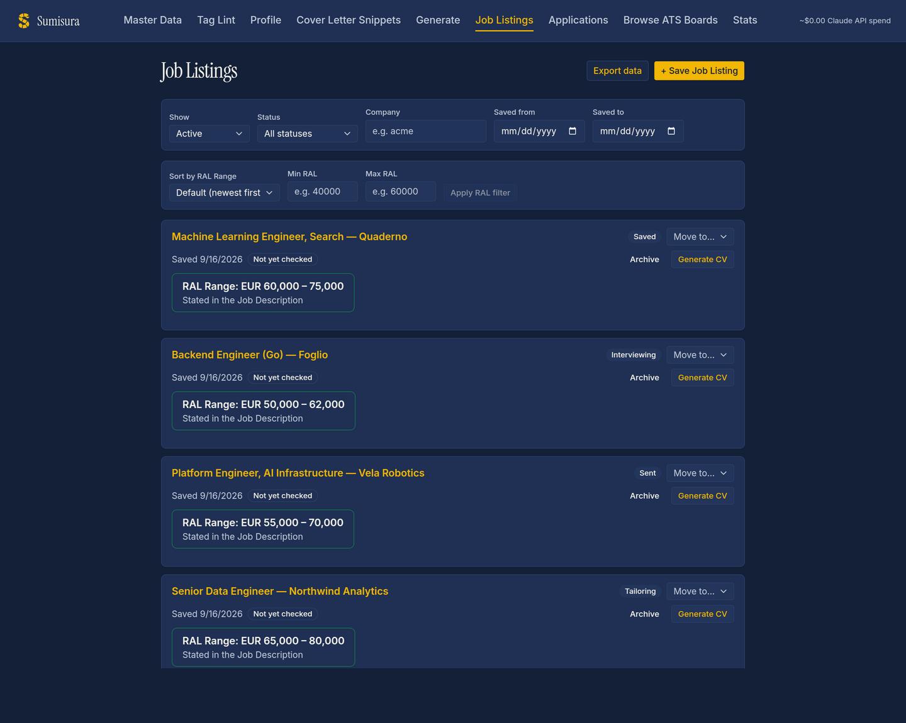
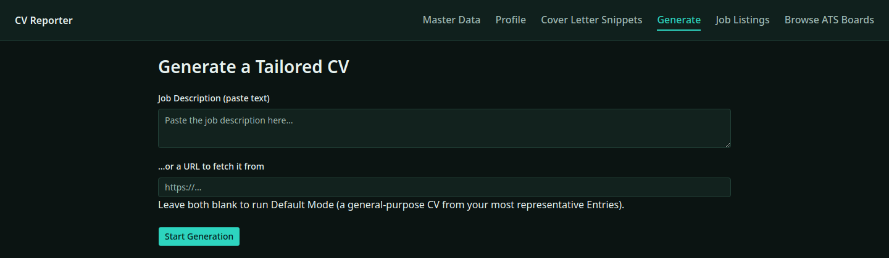

<p align="center">
  
</p>

<p align="center">
  A personal tool that turns one person's complete career history into a tailored, one-page CV — generated on demand for a specific job application.
</p>

<p align="center">
  
  
  
  
</p>

<p align="center">
  
</p>
<p align="center">
  
</p>

It is not a generic resume builder — it's built around one person's career history, and produces a *Tailored CV* per *Job Description*. This stays a personal tool, not a product pitched at other users.

See `CONTEXT.md` for the domain vocabulary (Master Data, Entry, Client Engagement, Selection, Rewrite, Tailored CV, Job Listing, Application, ...) and `docs/adr/` for why the architecture looks like this.

## Two parts

**1. The tailoring pipeline** — a Claude Code skill (`plugins/cv-reporter-skills/skills/tailor-cv/`), not a build script. Run it with a job description (pasted text or URL), a reference to an already-tracked Application, or nothing (Default Mode). It walks: Selection → Rewrite → Text Review (approval required) → Render → Visual Review (approval required). Rendering is done with [Typst](https://typst.app) (`typst` must be on `PATH`); there's no Node/JS involved in this part.

**2. The web app** — a standalone local app (Go backend + React/TypeScript/Vite frontend, run via `docker-compose`, localhost-only, no auth) for browsing and editing Master Data, and for tracking Job Listings and Applications. See `docs/adr/0004-standalone-web-app.md` and `docs/adr/0009-go-backend-react-frontend.md` for why.

Job Listings can be added to the web app three ways: manual paste (URL/text), pulling from an ATS's public job-board API (Greenhouse/Lever/Ashby), or a browser extension (`extension/`) that captures the LinkedIn or Indeed job posting you're currently viewing — see `docs/adr/0007-job-sourcing.md` for why it's scoped this way and [`extension/README.md`](extension/README.md) for how to load it and how capture works.

## Repo layout

- `data/profile.yaml` — contact info + Static Sections (education, publications, awards, activities, languages). Always included in full, never selected or rewritten.
- `data/experience/*.md`, `data/projects/*.md` — Master Data. One file per Entry: YAML frontmatter (`employer`/`client`/dates/`tags`/...) + Markdown bullets.
- `template/cv.typ` — pure presentation. Reads one assembled JSON file and renders it; contains no selection/relevance logic.
- `output/` — gitignored. Rendered PDFs and per-Generation assembled JSON are derived artifacts, not Master Data.
- `.claude-plugin/marketplace.json` + `plugins/cv-reporter-skills/` — a repo-local Claude Code plugin marketplace holding this repo's own skill(s), currently just `tailor-cv` (`plugins/cv-reporter-skills/skills/tailor-cv/`), the skill that drives the tailoring pipeline (see `docs/adr/0015-tailor-cv-distributed-as-repo-local-plugin.md` for why).
- `backend/` — Go HTTP API serving/editing the Master Data files under `data/`, and tracking Job Listings/Applications under `data/jobs/` and `data/applications/` (see `backend/internal/api`).
- `frontend/` — React + TypeScript + Vite app consuming that API.
- `extension/` — browser extension that captures the LinkedIn or Indeed job posting you're viewing into the app as a Job Listing (see [`extension/README.md`](extension/README.md)).
- `brand/` — logo (full lockup + icon-only mark) and color palette; the shared identity the web app's UI is meant to match.
- `docs/adr/` — architecture decision records.

## Running the tailoring pipeline

`tailor-cv` is served by this repo's own plugin marketplace (`.claude-plugin/marketplace.json`), not `.claude/skills/`. On a fresh clone, enable it once with:

```
claude plugin marketplace add .
claude plugin install cv-reporter-skills@cv-reporter-local
```

(or set `extraKnownMarketplaces`/`enabledPlugins` in `.claude/settings.json` to auto-enable it for every trusted checkout — see ADR-0015). Once installed, invoke it in Claude Code as `/cv-reporter-skills:tailor-cv`, with a job description, a reference to an already-tracked Application, or nothing (Default Mode). To render manually once a tailored data file exists:

```
typst compile --root . template/cv.typ output/<slug>/cv.pdf --input data=output/<slug>/data.json
```

Adding a new job or project means adding a new Markdown file under `data/experience/` or `data/projects/` following the existing frontmatter shape — not writing code.

## Running the web app

Generation calls the Claude API directly (ADR-0005), so copy `.env.example` to `.env` and fill in `ANTHROPIC_API_KEY` first — `docker-compose.yml` loads `.env` automatically and forwards it into the backend container. Without it the app still runs (Master Data browsing works); only Generation requests fail.

```
docker-compose up
```

- Backend: `http://127.0.0.1:8080` (reads/writes `./data`; Render also reads `./template` and writes `./output` — the whole project root is mounted into the container, see ADR-0012).
- Frontend: `http://127.0.0.1:5173`

### Backend API

| Method | Path | |
|---|---|---|
| GET | `/api/healthz` | health check |
| GET | `/api/master-data/entries` | list Entries |
| POST | `/api/master-data/entries` | create an Entry |
| GET | `/api/master-data/entries/{id}` | get an Entry |
| PUT | `/api/master-data/entries/{id}` | update an Entry |
| DELETE | `/api/master-data/entries/{id}` | delete an Entry |
| GET | `/api/master-data/profile` | get profile + Static Sections |
| PUT | `/api/master-data/profile` | update profile + Static Sections |
| GET | `/api/master-data/cover-letter-snippets` | list Cover Letter Snippets |
| POST | `/api/master-data/cover-letter-snippets` | create a Cover Letter Snippet |
| GET | `/api/master-data/cover-letter-snippets/{id}` | get a Cover Letter Snippet |
| PUT | `/api/master-data/cover-letter-snippets/{id}` | update a Cover Letter Snippet |
| DELETE | `/api/master-data/cover-letter-snippets/{id}` | delete a Cover Letter Snippet |
| GET | `/api/job-listings` | list Job Listings (with their Application) |
| POST | `/api/job-listings` | save a Job Listing (URL/text) — creates its Application; RAL Range + Application Method are best-effort (see ADR-0011; failures persist as `unresolved`, never block the save) |
| POST | `/api/job-listings/from-extension` | save a Job Listing captured by the browser extension (`extension/`) — same best-effort save as above |
| GET | `/api/job-listings/{id}` | get a Job Listing |
| POST | `/api/job-listings/{id}/resolve` | retry RAL Range/Application Method resolution for whatever is still `unresolved` on a Job Listing (no-op if both already resolved) |
| POST | `/api/job-listings/{id}/suggest-contact` | suggest an Application contact for a Job Listing |
| PATCH | `/api/applications/{id}/status` | move an Application's status (state machine — see `tracking.allowedTransitions`) |
| PATCH | `/api/applications/{id}/method` | correct an Application's Application Method |
| PATCH | `/api/applications/{id}/contact` | correct an Application's contact |
| GET | `/api/applications/{id}/mailto` | get a `mailto:` link prefilled for an Application |
| POST | `/api/applications/{id}/generations` | record a Generation against an Application |
| POST | `/api/generations` | run Selection+Rewrite (+ Cover Letter, + RAL Range if a Job Description is given) |
| POST | `/api/generations/render` | render approved Text Review content to a Tailored CV PDF (+ Cover Letter PDF) |
| GET | `/api/generations/{slug}/{file}` | fetch a rendered file (`cv.pdf`, `cover-letter.pdf`, `cover-letter.txt`) for preview/download |
| GET | `/api/ats/{provider}/{slug}/listings` | list public job-board listings from an ATS (Greenhouse/Lever/Ashby) |
| GET | `/api/ats/tracked-boards` | list tracked ATS boards |
| POST | `/api/ats/tracked-boards` | track an ATS board |
| DELETE | `/api/ats/tracked-boards/{id}` | stop tracking an ATS board |
| GET | `/api/export` | download a zip archive of Job Listing/Application data (`data/jobs/`, `data/applications/`) — a manual backup, since that data is gitignored (ADR-0008) unlike Master Data |

Backend tests are Go `testing`-package HTTP integration tests, run with `go test ./...` from `backend/`.

### Frontend dev loop

From `frontend/`: `npm run dev` (served by the `frontend` service above inside Docker), `npm run build`, `npm run lint`.

## Further reading

- [`CONTEXT.md`](CONTEXT.md) — domain vocabulary (ubiquitous language)
- [`docs/adr/`](docs/adr/) — architecture decision records
- [`extension/README.md`](extension/README.md) — how the LinkedIn/Indeed capture extension works and how to load it
- [`brand/palette.md`](brand/palette.md) — the color palette behind the logo, applied across the frontend's shadcn/ui theme
